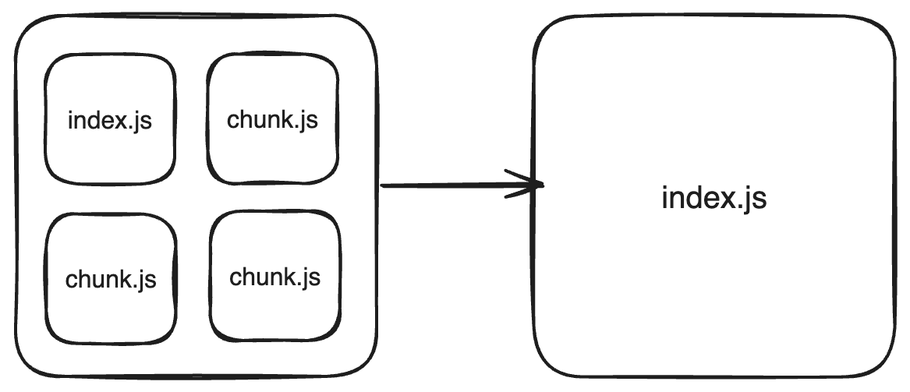
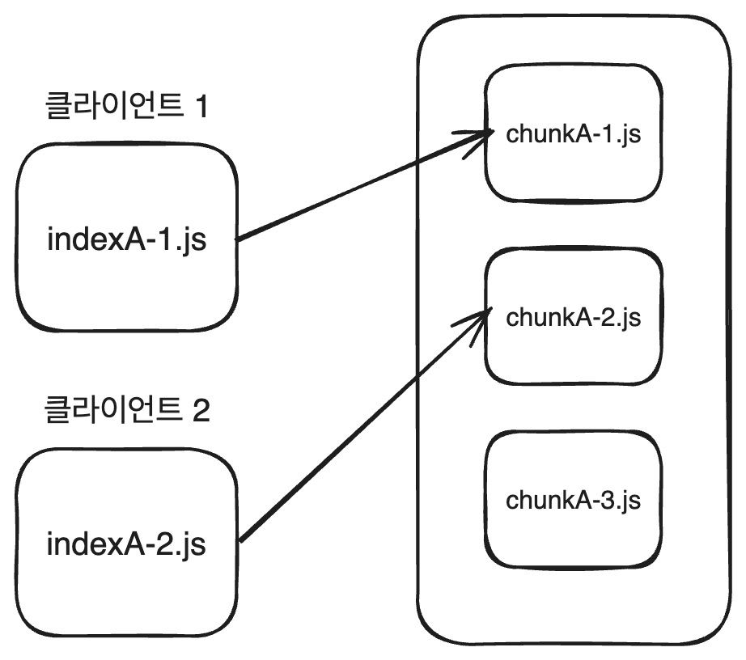
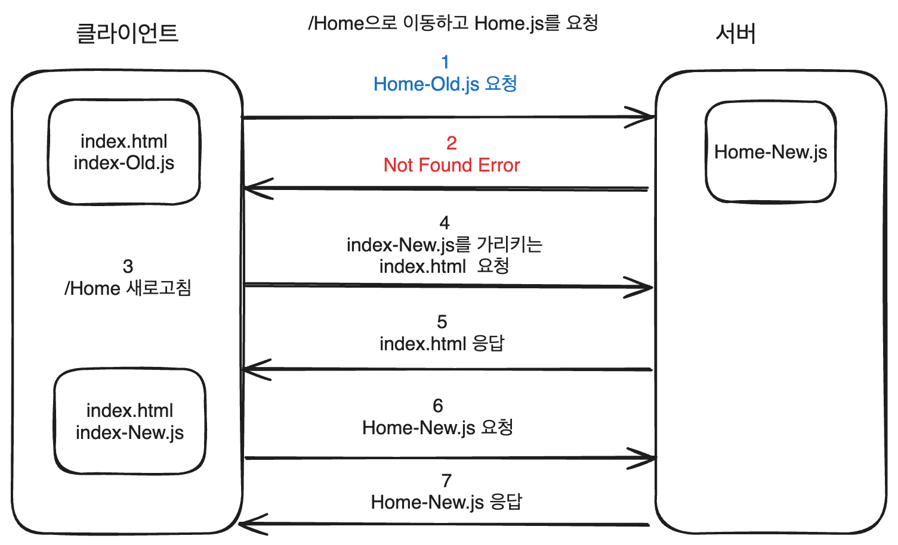

## 시작하며

"이해편"에서 ChunkLoadError가 발생하는 상황에 대해 알아보았습니다. 이번 "해결편"에서는 ChunkLoadError를 해결하는 방법에 대해 알아보겠습니다.

글을 시작하기전에 ChunkLoadError에 대한 간단한 사전 지식들을 정리하겠습니다.

### 1. ChunkLoadError는 번들러에 따라 에러메시지가 다를 수 있습니다

ChunkLoadError는 ECMAScript등에서 사용하는 공식적인 용어가 아니기 때문에 번들러에 따라 에러메시지가 다를 수 있습니다.

```js
webpack: 'ChunkLoadError';
vite: 'TypeError: Failed to fetch dynamically imported module';
```

이 글에서는 "ChunkLoadError"로 용어를 통일하겠습니다.

### 2. ChunkLoadError는 다양한 이유로 발생합니다

**"이해편"에서 살펴본 에러 상황은 특정한 상황**에서 발생합니다. 하지만 반드시 이러한 특정한 상황에서만 발생하는 것은 아닙니다. 아래와 같이 **chunk를 정상적으로 불러오지 못하는 상황**이라면 모두 발생할 수 있습니다.

- 일시적인 네트워크 에러
- 번들러의 chunk 경로 설정 오류
- CDN 또는 서버의 장애

이번 글에서는 "이해편"에서 전제한 특정한 상황에서 발생하는 상황을 중심으로 해결방법을 살펴보겠습니다.

---

## 해결방법

ChunkLoadError 해결방법은 다양합니다. 프론트엔드 어플리케이션 레이어에서 해결할 수 있는 방법도 있고, 웹 서버 레이어에서 해결할 수 있는 방법도 있습니다. 상황과 환경에 따라서 적절한 해결방법을 선택해야합니다.

해결 방법은 크게 두가지로 구분합니다.

1. ChunkLoadError를 발생시키는 **원인을 없애는 방법**
   - No chunk
   - No Hash
   - 모든 버전의 chunk를 저장
2. ChunkLoadError가 발생했을 때 **대응하는 방법**
   - 새로운 버전의 chunk를 요청

가장 쉬운 방법부터 살펴보겠습니다.

### 해결방법 1. No chunk



첫 번째 해결방법은 **chunk 자체를 생성하지 않는 방법**입니다. 어플리케이션을 메인 자바스크립트 파일 하나만으로 구성합니다.

허무한 해결 방법이라고 생각할 수 있지만 `어플리케이션 규모가 작은 경우 효율적인 해결 방법입니다.` 왜냐하면 chunk를 요청하고 응답하면 추가적인 네트워크 비용이 발생하는데 오히려 어플리케이션 규모가 작다면 **메인 자바스크립트 파일 하나만으로 어플리케이션을 구성하는 것이 더 효율적**일 수 있습니다.

> 사용자 입장에서 불편함을 느끼지 않는다면 섣부른 최적화를 하지 않는 것도 방법입니다.

### 해결방법 2. No Hash

**chunk의 해시를 제거하고 chunk의 버전을 하나로 관리하는 방법입니다.**

클라이언트는 매번 동일한 파일명을 가지는 최신 버전의 chunk를 요청합니다. 버전을 하나로만 관리하기 때문에 **chunk 파일의 캐시 설정은 바람직하지 않은 방법**입니다. 캐시를 설정하면 chunk 파일의 내용이 변경되어도 클라이언트는 여전히 이전 버전의 chunk를 사용하기 때문입니다. 캐시 설정을 할 수 없기 때문에 성능적으로는 좋지 않은 방법입니다.

`vite`에서는 다음과 같이 chunk의 해시를 제거할 수 있습니다.

```js
// vite.config.js

export default defineConfig({
  build: {
    rollupOptions: {
      output: {
        chunkFileNames: 'assets/[name].js',
      },
    },
  },
});
```

### 해결방법 3. 모든 버전의 chunk를 저장

세번째 방법은 **모든 버전의 chunk를 저장**하는 방법입니다.



웹 서버의 설정을 변경하여 SPA 어플리케이션을 배포할 때 이전 버전의 chunk를 서버에서 제거하지 않고 유지합니다.

업데이트와 배포가 빈번하게 일어나는 어플리케이션이라면 서버에 chunk 파일이 수없이 쌓이게 됩니다. 따라서 **chunk 파일을 관리하는 전략**이 필요합니다.

- 얼마 주기동안의 chunk를 저장할 것인가?
- 언제 chunk를 삭제할 것인가?

해시를 사용할 수 있기 때문에 캐시 설정을 할 수 있습니다. 하지만 chunk 파일을 관리해야하는 문제가 있습니다. 또한 추가적인 웹 서버 작업이 필요하기 때문에 번거로운 방법일 수 있습니다.

### 해결방법 4. 새로운 버전의 chunk를 요청하기

지금까지 소개했던 방법들은 ChunkLoadError를 발생시키지않도록 **에러의 원인을 없애는 방법**들이었습니다. 각 방법들은 조금씩 아쉬운 부분이 있습니다.

이번에는 ChunkLoadError가 발생했을 때 어플리케이션 레이어에서 **새로운 버전의 chunk를 요청하여 에러를 적절히 처리하는 방법**을 살펴보겠습니다.

일반적으로 SPA에서 Code Splitting은 `Route`를 분리할 때 사용합니다.([Route based code Splitting](https://legacy.reactjs.org/docs/code-splitting.html#route-based-code-splitting)). 따라서 Route의 변화에 따라 적절히 처리하는 것이 중요합니다.

전체적인 해결방법 흐름은 다음과 같습니다.



a. 유저가 "/Home" 라우트로 이동하기 위해 "Home-Old.js" chunk를 요청합니다. 이때 이전 버전의 chunk가 존재하지 않기 때문에 404 Not Found 에러와 함께 chunkLoadError가 발생합니다.

b. chunkLoadError가 발생하면 어플리케이션은 에러를 감지하고 해당 라우트에 일치하는 path(url)로 브라우저를 새로고침합니다.

c. 새로고침된 브라우저는 새로운 index.html, index.js를 서버에 요청하고 응답받습니다. 연쇄적으로 새로운 Home.js chunk를 다시 요청합니다.

핵심 아이디어는 `라우트를 이동할 때 chunkLoadError가 발생하면 새로고침`하는 것입니다.

브라우저를 해당 url로 새로고침해서 새로운 index.js, index.html을 응답받아 어플리케이션을 새롭게 실행하는 것입니다.

### 해결방법 4-1. Vue에서 해결하기

Vue의 공식 라우터인 `vue-router`는 라우트 변경시 에러를 감지하고 호출되는 onError 콜백을 제공합니다. onError 콜백에서 chunkLoadError를 감지하고 새로고침을 하는 방법으로 해결할 수 있습니다.

```js
// vue-router@v4

router.onError((error, to) => {
  // vite chunk error
  if (error.message.includes('Failed to fetch dynamically imported module')) {
    window.location.href = to.fullPath;
  }
});
```

### 해결방법 4-2. React에서 해결하기

vue-router는 라우터 레이어에서 onError 콜백을 제공하지만, `react-router-dom`은 onError 콜백을 제공하지 않습니다.(제가 알고있는 바로는..)

React에서는 `컴포넌트 레이어`에서 해결해야합니다. `ErrorBoundary` 컴포넌트를 사용하면 chunkLoadError 에러를 감지하고 해결할 수 있습니다.

```js
// ChunkLoadErrorBoundary
componentDidCatch(error: Error) {
    if (/Failed to fetch dynamically imported module/.test(error.message)) {
      window.location.reload();
    }
}


// router
const HomePage = lazy(() => import("./pages/HomePage"));
const router = createBrowserRouter([
  {
    path: "/home",
    element: (
      <ChunkLoadErrorBoundary>
        <HomePage />
      </ChunkLoadErrorBoundary>
    ),
  },
]);
```

또다른 해결방법으로는 Code Splitting을 하게 해주는 `lazy()`를 활용하는 방법이 있습니다. chunk를 불러올 때 에러를 catch하고 새로고침하는 방법입니다.

```ts
// reference:  https://github.com/vitejs/vite/issues/11804
import type { ComponentType } from 'react';
import * as React from 'react';

export const lazy = (factory: () => Promise<{ default: ComponentType<unknown> }>) => {
  return React.lazy(() => factory().catch(importErrorHandler));
};

export function importErrorHandler(err: string): {
  default: ComponentType<unknown>;
} {
  // 무한 새로고침을 방지하기 위해 storage에 마지막 새로고침 시간을 저장합니다.
  const timeStr = sessionStorage.getItem('last-reload');
  const time = timeStr ? Number(timeStr) : null;
  const now = Date.now();
  const isReloading = !time || time + 10_000 < now;
  if (isReloading) {
    sessionStorage.setItem('last-reload', String(now));
    window.location.reload();
    return { default: () => null };
  }

  throw err;
}
```

이 방법의 단점은 무엇일까요? 새로고침을 한다는 점에서 사용자 경험에 부정적인 영향을 미칠 수 있습니다. 하지만 일반적으로 라우트를 이동한다는 것은 새로운 페이지로 이동한다는 것을 의미합니다. 페이지가 바뀌면 화면 전체가 새롭게 렌더링되는 경우가 많기 때문에 사용자 경험에 큰 영향을 미치지 않는다고 생각합니다.

**만약 새로고침없이 새로운 버전의 chunk를 가져올 수 있는 방법이 있을까요?**

새로운 버전의 chunk를 가져오기 위해서는 번들러에서 chunk 파일명이 부여되는 해시를 예상할 수 있는 방법이 필요합니다. package.json의 어플리케이션의 version을 이용하는 방법을 생각해볼 수 있습니다. [참고](https://stackoverflow.com/questions/37416579/webpack-and-version-numbers-in-output-file)

## 마치며

이번 글에서는 특정상황에서 발생하는 ChunkLoadError를 해결하는 방법에 대해 알아보았습니다. 무조건적인 해결방법 대신 상황과 어플리케이션에 따라 적절한 해결방법을 선택해야합니다.

**개발환경에서는 발생하지않고 실제 서비스 환경에서만 발생하고, 특정한 조건이 만족이 되어야 발생**하는 에러입니다. 때문에 저도 실무에서 에러를 만났을 때 원인과 해결방법을 찾기가 쉽지 않았습니다. 이번 글이 다른분들에게는 조금이나마 도움이 되었으면 좋겠습니다.

### 참고

1. https://github.com/vitejs/vite/issues/11804

2. https://twitter.com/cpojer/status/1730141247900459166?t=yT1x3GDgin4uVW0oh1-Guw&s=31
