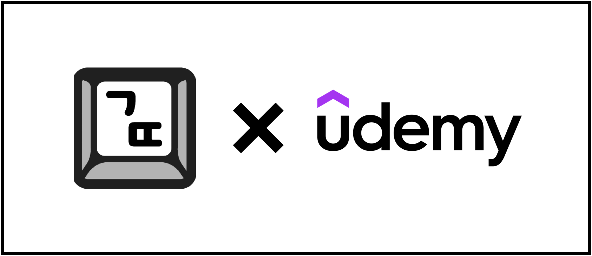

| 해당 콘텐츠는 유데미로부터 강의 쿠폰을 제공받아 작성되었습니다

현업에서 Vue를 메인 프레임워크로 사용하고 있다. 물론 이전에 React도 공부한 적도 있고 사내에서도 일부 프로젝트에 React를 쓰고있긴 하지만 메인으로 사용하고 있지 않기 때문에 React 개념과 사용법이 가물가물해졌다. React 복습을 체계적으로 해보고 싶었던 찰나에 기회가 생겨 강의를 수강하게 되었다.

개인적으로 라이브러리나 프레임워크를 학습할 때는 `공식문서`를 가장 우선시 하는 편이지만, React는 이미 공부한 적이 있었고 공식문서도 틈틈이 보고 있기 때문에 이번에는 조금 다른 방법으로 학습을 해보고 싶어서 강의를 듣기로 결정했다.

막상 강의를 골라보니 완강한 사람이 있을까 싶을정도로 강의양 자체가 워낙 많았는데, 필요한 부분만 취사선택하면서 듣기로 했다.

### 좋았던 점

**개념 설명**

React에 대한 개념을 겉핥기식으로 설명하는 것이 아니라 핵심을 잘 짚어서 디테일하게 설명한다고 느꼈다. 일례로 `useEffect`에 대해 설명이 대표적이다.

국내 다른 React 강의에서는 `useEffect`를 설명할때 단순하게 API와 사용법에 대해서만 설명하는 경우가 많다. 그래서 의존성 배열이나 clean up 함수와 같이 부가적인 내용을 핵심인 것 처럼 설명하거나 컴포넌트 life cycle과 개념을 함께 묶어서 useEffect가 단순히 컴포넌트 life cycle 메서드를 대체하는 것처럼 설명하는 강의도 많이보았다.

하지만 이 강의는 `Side Effect`의 개념부터 시작해서 `useEffect`가 어떤 역할을 하는지, 어떤 문제를 해결하는지, 어떤 상황에서 사용해야 하는지 등을 자세히 설명한다. 거의 1시간 넘는 시간동안 `useEffect`에 대해 설명을 할애하는데, 어떤 상황에서 사용하면 좋고 어떤 상황에서는 필요없는지, 그리고 사용하지 말아야하는 지 등을 상세히 설명한다. 다른 강의에 비해 좀 더 근본적인 개념을 설명하는 것 같아서 좋았다.

**풍부한 강의 컨텐츠**

총 강의 시간이 70시간에 달할만큼 강의 컨텐츠가 엄청 풍부하다. React 뿐만 아니라 Redux, Next.js, TypeScript, Tanstack Query등의 다양한 기술도 다루고 있다. 물론 모든 기술 하나하나를 깊게 다루진 않는다. **하지만 각 기술에 대해 찍먹하는 정도로는 괜찮아 보인다**. 여러 기술을 다루기 때문에 강의 영상 수도 엄청나게 많은데 처음부터 모든 강의를 들으려고 하기보다는 핵심 강의를 먼저 듣고 필요한 부분만 선택적으로 듣는 것이 좋을 것 같다.

**짧은 영상 길이**

강의 하나의 영상 길이가 3분 ~ 7분정도로 짧기 때문에 집중력을 유지하기에 좋다. 주제별로 잘 나눠져 있어서 필요한 부분만 찾아서 듣기도 좋다. 심리적으로 어떤 효과인지는 모르겠지만 개인적으로도 1시간짜리 영상 하나를 끝까지 듣는것보다 10분짜리 영상 10개를 듣는 것이 훨씬 쉽다고 느껴졌기 때문에 좋은 구성이라고 생각한다.

**최신 내용 업데이트**

강의가 꽤나 오래전부터 있었던 것 같은데 업데이트는 꾸준히 이루어지고 있는 것 같다. 예전 버전의 강의는 모두 삭제되고 최신 버전의 강의를 제공해준다.

그리고 전 세계로부터 엄청난 수의 수강생으로부터 피드백을 받아서 그런지 강의 내용이 꽤나 꼼꼼하게 업데이트 되는 것 같다. 강의를 들으면서 내용이 틀렸다거나 하는 느낌은 거의 없었다.

**강의력**

강사분이 이미 유데미에서 유명한 외국 강사분인 것 같은데 강의력이 꽤 괜찮은 것 같다. 설명을 할 때 군더더기 없이 핵심만 잘 전달한다는 느낌을 받았다. 영상 편집도 잘 되어있어서 버벅이거나 끊기는 부분없이 영상 흐름이 깔끔하다. 개인적으로 잘 맞는 강의 스타일이었다.

**시각 자료**

코드만 따라서 치거나 말로만 설명하고 넘어가는 강의가 아니라 어려운 개념에 대해서는 이미지나 영상같은 시각적인 자료가 잘 활용되어 있다. 국내 플랫폼 강의에서는 정적인 PPT로만 강의하는 경우가 많은데 퀄리티 있는 시각 자료들을 활용하고 있어서 이해하기 훨씬 쉬웠다.

**비용**

개인적으로 유데미의 가장 큰 장점 중 하나가 강의 퀄리티에 비해 수강 비용이 압도적으로 저렴하다는 것이다. 현재 기준 17,000원 정도에 수강할 수 있는데 이정도 가격에 이정도 퀄리티의 강의는 국내 플랫폼에서는 찾아보기 힘들지 않을까 싶다. 가격도 저렴할 뿐만 아니라 강의 퀄리티도 훨씬 좋으니 굳이 다른 강의를 찾아보지 않아도 될 것 같다.

### 아쉬웠던 점

**영어 강의**

한글 자막이 나름 괜찮게 되어있긴 하지만 기본적으로 영어 강의기 때문에 영어기피증(?)이 있는 분에게는 부담스러울 수 있을 것 같다. 화면에 나오는 설명이나 시각자료들은 한글로 번역이 안되어있는 경우가 많기 때문에 영어를 잘 못하는 사람에게는 이해하기 어려울 수도 있다.

개인적으로는 **개발자라면 가장 친해져야할 언어가 영어**라고 생각하기 때문에 영어에 대한 부담감이 있더라도 영어 강의를 억지로(?) 들어서라도 영어 실력을 키우는 것도 좋은 방법이라고 생각한다.

**딥 다이브 보다는 핵심을**

React의 내부 코드까지 낱낱이 뜯어서 보는 강의는 아니기 때문에 React에 대해 엄청나게 딥 다이브한 내용을 원하는 분에게는 아쉬울 수 있다(근데 이 정도로 딥 다이브하는 강의가 있기는 한가? 있다면 알려주길 바란다...) 그럼에도 불구하고 핵심적인 내용을 잘 설명해주는 것 같아서 나쁘지 않다고 생각한다.

**Redux**

강의 제목에도 나와있듯이 상태관리 라이브러리에 대한 강의로는 Redux를 다루고 있다. 뭔가 요즘 핫하다고 들리는 Zustand나 jotai 같은 상태관리 라이브러리에 대한 언급이 없는 것이 조금 아쉬울 수 있다. 주변에 React를 실무에서 사용하고 있는 개발자들에게 주워들은 얘기로는 이미 Redux가 아니라 다른 상태관리 라이브러리들로 넘어가는 추세라고 한다. Redux가 여전히 npm 다운로드 수가 압도적이고 중요한 라이브러리이긴 하지만 아쉬운 점이라고 생각한다.

**질의응답**

아무래도 외국 강사이고 플랫폼 특성 때문인지 강의 내용에 대한 직접적인 질의응답을 주고 받는 것은 어려워 보인다. 아마 강사와 질의응답을 주고받으려면 별도의 디스코드에 접속해서 강사와 소통해야하는 것으로 보인다. 유데미 홈페이지에서는 한글 번역을 맡은 웅진씽크빅에서 질의응답을 하긴 하지만 강의 내용에 대한 질문이라기 보다는 자막이나 운영적인 것이 대다수다. 이런 부분은 국내 플랫폼에서 진행하는 국내 강사의 강의를 듣는 것과 가장 큰 차이점이라고 생각한다.

### ⭐️ 총평

**결론을 내리자면 React를 처음 접하는 사람이거나 React 개념을 복습하고 싶은 사람에게 추천하는 강의이다.** 앞서 말했듯이 강의 수가 엄청나기 때문에 필용한 부분만 선택적으로 들어도 충분히 가치가 있을 것 같다. 나도 Redux나 Tanstack Query와 같은 이미 알고있는 기술에 대한 강의는 건너뛰고 React에 대한 강의만 들었는데도 충분히 만족스러웠다.

유데미에서 외국 강의를 듣는 것은 처음인데 괜히 압도적인 수강생 수가 있는게 아닌 것 같다.
