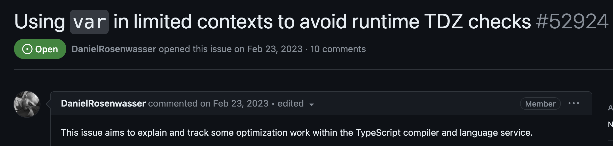
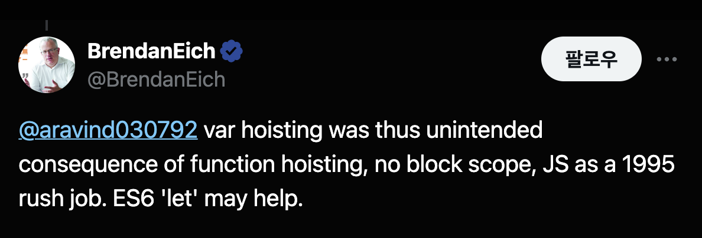
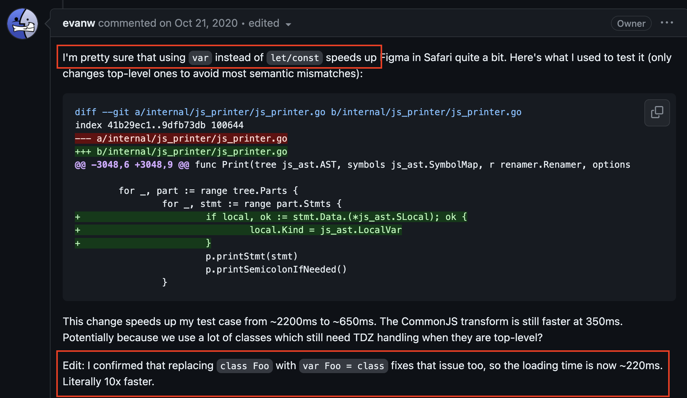
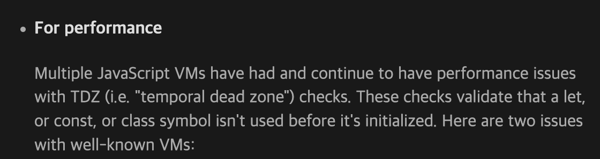

TypeScript Github를 구경하다가 재미있는 이슈를 보았다. 성능을 위해 **let, const로 작성된 코드를 var로 변경한다**는 내용이었다.

<br/>


<br/>
<br/>

- [Using var in limited contexts to avoid runtime TDZ checks #52924](https://github.com/microsoft/TypeScript/issues/52924)

TypeScript v5.0부터 TypeScript의 내부 구현은 es5에서 es2018으로 변경되었다. 이때 var를 제거하고 let, const로 변경하는 작업을 진행했는데, **오히려 성능이 떨어지는 문제가 발생했다고 한다**!. 그래서 일부 코드에 대해 다시 var로 되돌아가기로 결정했다는 내용이다.

개인적으로 ES6 이후로 자바스크립트를 배웠기 때문에 var를 코딩할 때 사용해본 적은 없다. 당연히 var를 `무조건` 사용하지 않는 것이 좋다고 알고 있었다. var는 여러 문제점을 가지고 있고 let, const는 var의 상위호환으로 완벽하게 대체가능하기 때문이다.

그런데 성능적인 측면에서 var 키워드가 더 빠르다는 것은 처음 들어보는 이야기였다. 좀 더 찾아보니 ECMAScript 위원회인 [TC39](https://github.com/tc39/notes/blob/main/meetings/2023-09/september-27.md#tdz-what-is-it-good-for) 회의에도 논의될 정도로 꽤나 이슈였던 주제였다.

조사를 해보니 꽤나 흥미로운 내용이었기 때문에 정리해보려고 한다.

### var 키워드

짧은 개발기간(10일)동안 만들어진 프로그래밍 언어답게 다른 언어와 다르게 자바스크립트는 이상하고 재미있는 특징이 많다.

특히 변수를 선언하는 var 키워드는 스코프, 중복 선언 가능, 호이스팅 등 여러 문제점을 가지고 있다.

이 중 호이스팅은 다른 프로그래밍 언어 개발자가 보면 정말 이상하게 느낄 수 있는 특징인데, var로 선언한 변수는 `선언 전에 사용할 수 있다`는 특징을 가지고 있다.

```js
{
  console.log(a); // undefined
  var a = 1;
}
```

다른 프로그래밍 언어라면 에러를 발생시킬 것 같지만 자바스크립트는 에러없이 undefined를 출력한다. 변수 a를 선언하기 전에 a를 참조하고 있음에도 이 코드는 에러없이 정상적으로 동작하는 것이다.
`호이스팅`이라는 개념 때문에 발생하는 현상인데, 자바스크립트를 만든 Brendan Eich에 따르면 이러한 var 호이스팅은 바쁜 작업으로 인한 의도하지 않은 결과라고 한다. (**급하게 작업하느라 그랬다고 한다....)**

<br/>


<br/>
<br/>

이렇게 선언 전에 변수를 사용할 수 있고, 에러를 전혀 발생시키지 않는 var 키워드는 잠재적인 버그를 만들기 쉽다. DX(Developer Experience)를 떨어뜨리는 요소이기도 하다.

대부분의 프로그래밍 언어가 그렇듯이 선언 전에 변수를 사용할 때 에러를 발생시키는 것이 더 좋은 DX를 제공할 수 있다. 이런 이유로 ES6부터 let, const 키워드가 등장하게 되었다.

### let, const

var이 가진 문제를 해결하기 위해 ES6(ES2015)에서 등장한 let, const는 `TDZ`(Temporal Dead Zone)이라는 개념을 도입하여 문제를 해결한다.

TDZ는 이름 그대로 `임시적인 사각지대`를 의미한다. 변수가 선언되기 전까지 변수를 사용할 수 없는 영역을 말한다.

```js
{
  console.log(a); ---  // TDZ에 있는 a를 참조하려고 하면 ReferenceError 발생한다
  ...                | // TDZ
  ...                | // TDZ
  ...             ---

  let a = 1;
}
```

선언 이전에 참조한 변수 a를 `TDZ에 존재한다`라고 한다. 만약 `TDZ`에 존재하는 변수를 참조하려고 하면 자바스크립트 엔진은 런타임에 `ReferenceError`를 발생시킨다. 이렇게 명시적인 에러를 발생시킴으로써 개발자가 의도하지 않은 버그를 만들지 않도록 도와준다.

어떤 변수가 TDZ에 있는지 확인하는 것을 TDZ Check(TDZ 검사)라고 한다. 자바스크립트 엔진은 코드를 본격적으로 실행하기 전, 초기화 단계에서 let, const로 선언된 변수에 대해 TDZ 검사를 수행한다. 런타임에 TDZ 검사를 수행하는 것이다. var는 TDZ 검사가 필요없다.

**자바스크립트 엔진이 TDZ 검사를 한다는 것은 런타임 비용을 발생시키는 것이다.** "은빛 총알은 없다"는 말이 있듯이, 안전한 코드를 작성하기 위해 지불해야하는 트레이드오프이다.

V8과 같은 최신 자바스크립트 엔진은 다양한 최적화를 수행하기 때문에 소규모 코드베이스의 TDZ 검사는 거의 무시할 수 있는 수준이다.
**하지만 경우에 따라 TDZ 검사 비용이 무시할 수 없을 정도로 커질 수 있다.**

### TDZ 검사

모든 TDZ 검사가 무거운 비용을 필요로하는 것은 아니다. 아래 코드와 같이 자바스크립트 엔진이 쉽게 분석할 수 있는 경우 TDZ 검사 비용은 값싸다고 할 수 있다.

```js
{
  let x;
  x;
}
```

하지만 다음 예시처럼 복잡한 경우 자바스크립트 엔진이 수행하는 TDZ 검사 비용은 커질 수 있다.

```js
{
  foo(); // ReferenceError: x is not defined

  let x;
  function foo() {
    x;
  }
}
```

foo 함수가 에러없이 호출되기 위해서는 foo 함수가 참조하고 있는 **최상위 공유 클로저 변수 x**가 평가되었는지 먼저 확인해야한다.
let으로 선언되었기 때문에 x가 TDZ에 있는지 확인해야하는데 x는 foo 함수 내부에서 선언된 변수가 아니기 때문에 전체 스코프를 검사해야한다.
대규모 코드베이스에서 TDZ 검사 비용은 의미있을 정도로 커질 수 있다.

추가로 이러한 TDZ 검사 비용은 자바스크립트 엔진에 의존적이다. 따라서 엔진마다 TDZ 검사 비용이 다를 수 있다.
실제로 Webkit의 자바스크립트 엔진인 JavaScriptCore는 let, const가 var 보다 무려 10배 느린 문제점이 존재했었다. (\*현재는 고쳐진 것으로 보인다.)

- [Safari에서 10배 느린 let, const 성능 문제 이슈](https://github.com/evanw/esbuild/issues/478)
- [Webkit 버그 리포트](https://bugs.webkit.org/show_bug.cgi?id=199866)

<br/>


<br/>
<br/>

V8 엔진 역시 var과 let,const에 10%정도의 성능 차이가 존재한다고 한다. ([V8 버그 리포트](https://bugs.chromium.org/p/v8/issues/detail?id=13723))

### 사례 보기 - TypeScript

TypeScript가 var로 성능을 향상시킨 예시를 보자. 다음은 TypeScript Compiler의 소스코드 중 일부이다. (TypeScript의 내부 동작원리는 몰라도 된다)

```js
// src/compiler/parser.ts

// const -> var로 전환
var scanner = createScanner(ScriptTarget.Latest, /*skipTrivia*/ true);

function initializeState() {
  // .....
  // .....
  // .....
  // .....
  scanner.setText(sourceText);
  scanner.setOnError(scanError);
  scanner.setScriptTarget(languageVersion);
  scanner.setLanguageVariant(languageVariant);
}
```

TypeScript 내부에서 사용하는 var로 선언된 scanner라는 변수가 있다.
scanner는 생성 비용이 크기 때문에 매번 새롭게 생성하는 것은 비효율적이다. 따라서 최상위 레벨 스코프에서 한 번만 생성하고 함수들이 공유해서 사용한다.

자바스크립트 엔진은 런타임에 const로 선언된 scanner 변수에 대해 TDZ 검사를 수행해야한다. parser.ts 파일 하나의 전체 라인은 **10,000줄**이 넘는다. 대규모 코드베이스에 존재하는 변수 scanner를 참조하는 함수가 많다면 해당 함수를 호출하거나 참조할때마다 생기는 TDZ 검사 비용은 커질 수 있다.

TypeScript 팀은 const로 선언된 scanner를 var로 변경하여 TDZ 검사 비용을 줄였는데 **실제로 var 키워드로 전환하는 것만으로 최대 10~13% 정도의 성능 향상을 가져왔다고 한다.** https://github.com/microsoft/TypeScript/pull/52832

물론 무턱대고 변경한 것이 아니라 코드에 대한 이해를 바탕으로 변경한 것으로 보인다. 변수 scanner 생성이 보장되고 scanner를 참조하는 함수들은 이후에 호출된다는 것을 알고 있었기 때문에 변경한 것으로 보인다.

### esbuild

번들링 도구 중 하나인 esbuild도 var 키워드를 사용하여 성능 최적화를 돕는다.
esbuild는 번들링 과정에서 최상위 레벨의 let, const로 작성된 코드를 var로 변환해주는데 마찬가지로 TDZ 검사 비용을 줄이기 위한 목적이다.

<br/>


<br/>
<br/>

### 그렇다면 var을 사용해야할까?

대규모 코드베이스에서 var은 let, const 보다 빠를 수 있다는 것은 사실로 보인다. 하지만 이는 자바스크립트 엔진에 의존적인 문제이기 때문에 엔진 최적화등에 의해 언제든지 바뀔 수 있어보인다.

하지만 대부분의 프론트엔드 개발자들은 React, Vue 같은 프레임워크 위에서만 개발을 하는 경우가 많기 때문에 이러한 디테일한 성능 최적화에 대부분 신경쓰지 않는 것이 현실이다.

만약 극단적인 성능 최적화를 달성해야한다면 var를 사용하여 TDZ 검사를 회피하고 자바스크립트 엔진의 런타임 비용을 줄이는 것도 하나의 방법이 될 수 있다. **성능과 var이 가진 문제점 사이의 트레이드오프를 고려하여 사용하면 될 것이다.**

### 정리

이번 조사를 하면서 단순히 var는 let, const보다 빠르다는 것만 알았던 것이 아니라, 모든 것에는 트레이드오프가 존재한다는 것을 다시 한번 느꼈다.

누군가는 어떤 기술에 대해 `무조건 사용하지 말아야한다`라고 쉽게 주장하기도 한다.

"function 키워드 대신 화살표 함수를 사용해야한다" "TypeScript Enum 대신 as const를 사용해야한다" 등등이 그러하다. var도 그 중 하나일 것이다.

하지만 해당 기술(문법)이 deprecated된 것이 아니라면, 해당 기술이 존재하는 이유가 있다는 것을 잊지 않아야한다.

예전에 [함수 선언문을 사용하는 이유](https://velog.io/@sa02045/%ED%95%A8%EC%88%98-%EC%84%A0%EC%96%B8%EC%8B%9D%EC%9C%BC%EB%A1%9C%EC%9D%98-%ED%9A%8C%EA%B7%80)에 대해 조사했을 때 봤던 인상적인 글로 마무리한다.

> Expand your code vocabulary, don’t deliberately limit it! That’s how to become a better programmer. (코드 어휘력을 확장하고, 의도적으로 제한하지 마세요! 그것이 더 나은 프로그래머가 되는 방법입니다.)
